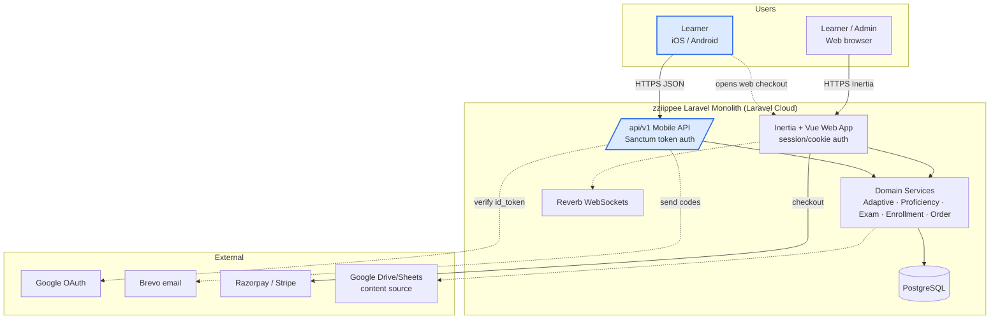
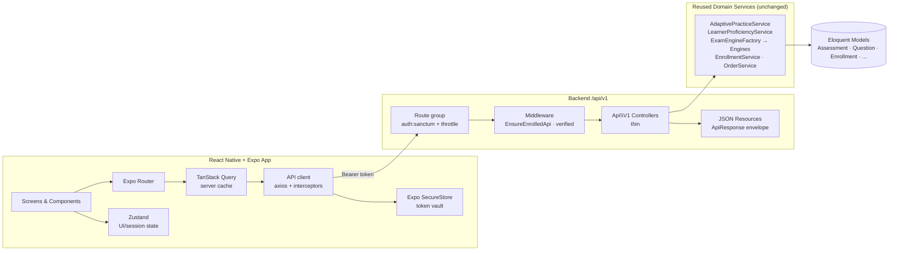
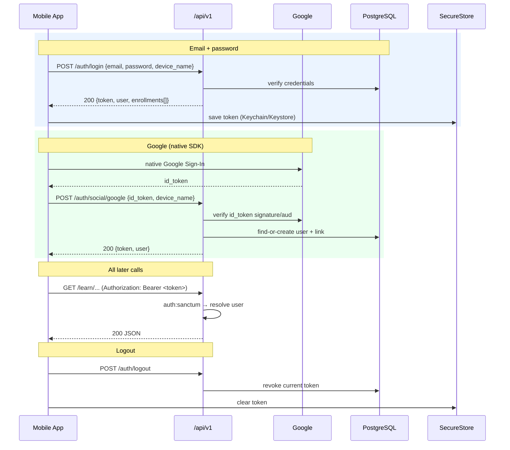
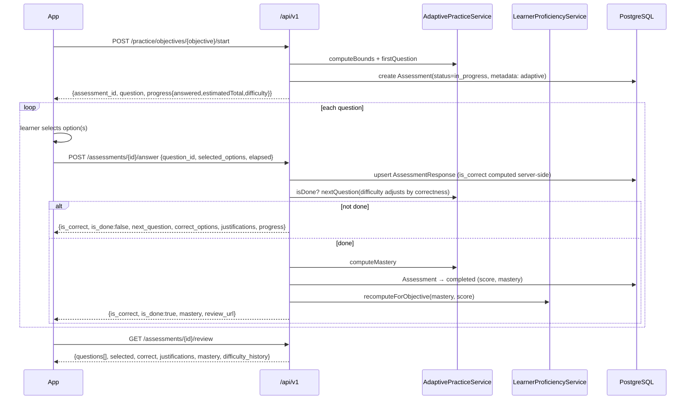
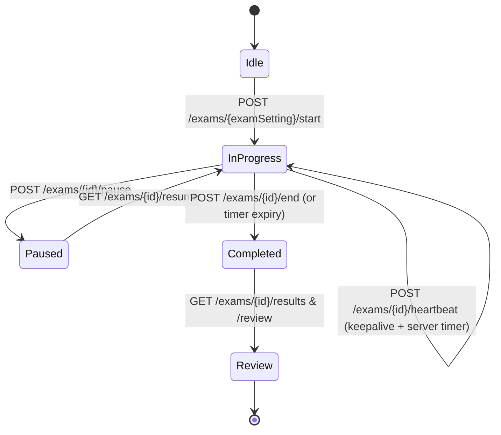
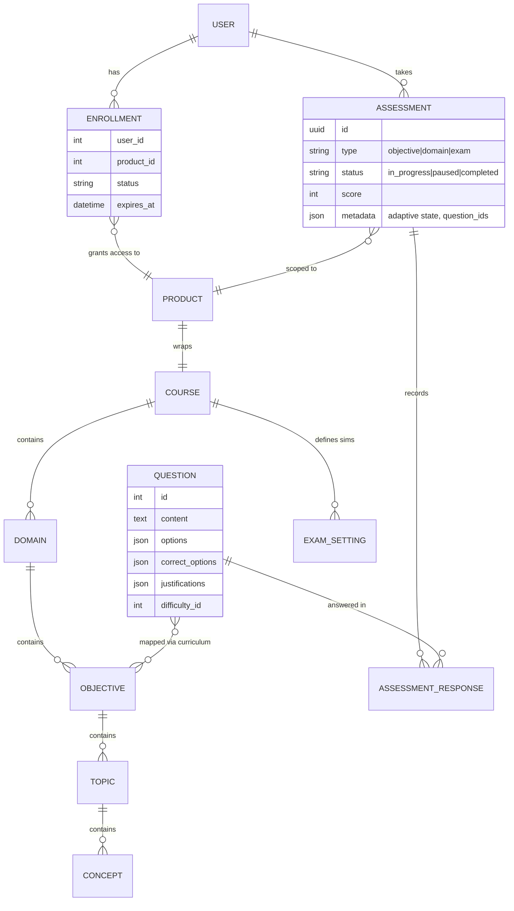

# 2 · System Architecture

Diagrams are in Mermaid so they render on GitHub and in most IDEs. They cover:
system context, containers, the auth/token sequence, the adaptive-practice
sequence, and the slice of the domain model the mobile app touches.

## 2.1 System context

**Blue = new work.** The mobile app and the `/api/v1` layer are the only new
components; everything else already exists. Purchases are intentionally routed to
the existing web checkout (deep-link out), not re-implemented natively.

## 2.2 Container / layer view

Key principle: **controllers stay thin, business logic is not duplicated.** The API
controllers call the very same Services the Inertia controllers already use, so
scoring and adaptivity behave identically on web and mobile.

## 2.3 Authentication & token lifecycle

Mobile uses **Laravel Sanctum personal access tokens** (Bearer), not cookies. Three
entry paths — email/password, Google, and the existing email-code verification —
all converge on "issue a Sanctum token."

- **Email verification** reuses the existing code-based flow, re-exposed under
  `/api/v1/auth/email/*` returning JSON. `verified` middleware still gates practice.
- **Token storage:** `expo-secure-store` (iOS Keychain / Android Keystore). Never
  AsyncStorage for tokens.
- **401 handling:** an axios response interceptor clears the token and routes to
  Login on `401`.
- **Refresh strategy (v1):** long-lived token + re-login on expiry/`401` (simple).
  A refresh-token pair can be added later without changing app screens.

## 2.4 Adaptive practice — request sequence

This is the core learning loop. It mirrors `ObjectivesController` +
`AdaptivePracticeService`, but stateless-per-request over JSON.

Notes reflecting the real engine:
- **Correctness, difficulty selection, mastery, and scoring are decided
  server-side** — the app never trusts client scoring. The app renders the returned
  `correct_options` + `justifications` *after* submit (same reveal rule as web).
- **Option order is shuffled deterministically server-side** (`OptionShuffler`), so
  the app just renders the options array it receives.
- **Pause/resume:** `POST /assessments/{id}/pause` snapshots elapsed time; reopening
  `GET /assessments/{id}` resumes with the current question and accumulated time.
- **Domain tests** follow the same shape under `/practice/domains/{domain}/...`.

## 2.5 Exam simulation flow

Exam sims use the `ExamEngineFactory` (policy from `ExamSetting`): `linear_locked`
→ `SimulationEngine` (no back-nav, timed), else `LinearPracticeEngine`.

- The **server owns the timer** (heartbeat + `started_at`), so closing the app can't
  cheat the clock; the app shows a countdown synced from server time.
- Exam Assessments use **UUID** ids (web routes already `whereUuid`).

## 2.6 Domain model — the slice mobile touches

**Access rule that the API must enforce (as web does):** a learner may only reach
`learn/practice/exam` data for a `product` they hold an **active `Enrollment`** for
(`EnsureEnrolledApi`), and may only read/write their **own** Assessments
(`user_id === auth id`). These are exactly the checks in the current controllers.

## 2.7 Cross-cutting concerns

| Concern | Approach on mobile / API |
|---|---|
| **Caching** | Online-first. TanStack Query caches GET responses (course tree, study notes, flashcards). Practice mutations always hit network. See doc 4. |
| **Rate limiting** | Reuse named throttles (`throttle:pbq-submit`, exam throttles); add `throttle:api` per token. |
| **Errors** | Uniform `ApiResponse` envelope + HTTP status; app maps to typed error UI. |
| **Content sanitization** | Question/notes HTML sanitized server-side; app renders via vetted markdown/HTML view. |
| **Observability** | Structured logs via existing `LoggingService`; app crash/analytics via Expo (Sentry). |
| **Versioning** | Path-versioned `/api/v1`; additive changes only within a version. |
| **Realtime (later)** | Reverb exists; not needed for v1. Push via Expo Notifications for reminders/streaks in a fast-follow. |
