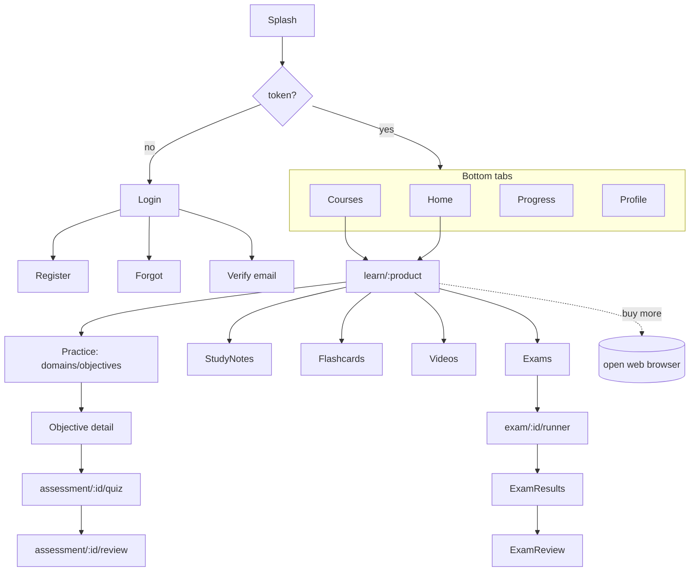
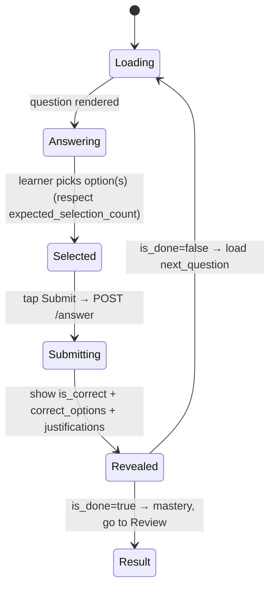

# 4 · Mobile App Design (React Native + Expo)

## 4.1 Stack

| Concern | Choice | Why |
|---|---|---|
| Runtime | **React Native (New Architecture)** via **Expo SDK (managed)** | One codebase; native modules without ejecting; EAS build/submit/OTA |
| Language | **TypeScript (strict)** | Team fluency; shared DTOs generated from OpenAPI |
| Navigation | **Expo Router** (file-based) | Typed routes, deep links (needed for verify/reset + web-checkout return) |
| Server state | **TanStack Query** | Caching, retries, background refetch, online-first fits perfectly |
| Client state | **Zustand** | Tiny; session/token, active-assessment UI state |
| HTTP | **axios** + interceptors | Bearer injection, 401 handling, error normalization |
| Secure storage | **expo-secure-store** | Keychain / Keystore for the token |
| Forms/validation | **react-hook-form + zod** | zod also validates API payloads |
| Content rendering | **react-native-markdown-display** (or `react-native-render-html`) | Renders sanitized question/notes HTML |
| Auth (Google) | **@react-native-google-signin** | Native id_token → `/auth/social/google` |
| Notifications (later) | **expo-notifications** | Reminders/streaks |
| Analytics/crash | **Sentry (expo)** | Crash + perf |
| Testing | **Jest + RN Testing Library**; **Maestro** for E2E | Unit + flow tests |

## 4.2 Project structure

```
zziippee-mobile/
  app/                          # Expo Router routes (screens)
    (auth)/
      login.tsx  register.tsx  verify-email.tsx  forgot-password.tsx
    (tabs)/
      index.tsx                 # Home / dashboard
      courses.tsx               # My enrollments
      progress.tsx              # Proficiency & mastery
      profile.tsx
    learn/[product]/
      index.tsx                 # Course home (nav tiles)
      practice/index.tsx        # domains → objectives list
      practice/[objective].tsx  # objective detail (start/resume)
      domains/[domain].tsx
      study-notes/index.tsx  study-notes/[topic].tsx
      flashcards.tsx  videos.tsx
      exams/index.tsx
    assessment/[id]/
      quiz.tsx                  # the practice runner (objective + domain)
      review.tsx
    exam/[id]/
      runner.tsx  results.tsx  review.tsx
    _layout.tsx
  src/
    api/
      client.ts                 # axios instance + interceptors
      generated/                # types generated from OpenAPI
      hooks/                     # useLogin, useEnrollments, useObjective, useAnswer...
    components/                  # QuestionCard, OptionList, Timer, MasteryBadge, ProgressBar...
    features/
      auth/  practice/  exam/  study/
    stores/                     # zustand: session, activeAssessment
    lib/                        # theme, format, sanitize, deep-linking
    theme/                      # design tokens (mirror web Tailwind)
  app.json / eas.json
```

## 4.3 Navigation map



## 4.4 Data & caching (online-first)

**Principle:** reads are cached for snappy UX; **all scoring/answer writes go to the
network** (the server is the source of truth for correctness, adaptivity, timing).

| Data | Cache policy |
|---|---|
| `/enrollments`, `/dashboard` | `staleTime` 2–5 min; refetch on focus |
| Course tree (`/learn/{p}/domains`) | `staleTime` 15 min; persist to disk (rarely changes) |
| Study notes / flashcards / videos | Persisted cache (read-mostly); show cached instantly, revalidate |
| Question during a quiz | Not cached across sessions; held in Query cache for the active assessment |
| `answer` / `pause` / exam `submit-answer` | **Never cached.** Mutations only. Retry with backoff on transient network errors. |

**Persistence:** TanStack Query + `AsyncStorage` persister (whitelist read-mostly
keys). Token lives only in SecureStore.

**Connectivity UX:** a global "offline" banner (via `@react-native-community/netinfo`);
disable the Submit button and queue nothing in v1 (online-first). If a practice
answer fails mid-quiz, show inline retry — the assessment is resumable server-side.

**Resume-on-reopen:** on launch, if the app had an in-progress/paused assessment,
`GET /assessments/{id}` (or `/exams/{id}`) rehydrates the current question + timer —
this is a first-class feature, matching the web's pause/resume.

## 4.5 The practice runner (core screen) — behavior

State machine per question (client mirrors server contract):



Rules baked in from the backend engine:
- Enforce `expected_selection_count` (single vs multi-select) in the UI.
- **Never compute correctness locally**; display only what `/answer` returns.
- Show the returned **justifications** only after submit (reveal rule).
- Persist `question_elapsed_seconds` (per-question timer) and send on submit.
- Adaptive: the app shows an "estimated total / answered" progress bar from
  `progress`, not a fixed count (question count is dynamic).

## 4.6 Exam runner specifics

- **Server-authoritative timer:** derive countdown from `deadline_at` /
  `remaining_seconds` returned by `start`/`heartbeat`; ping `heartbeat` every
  ~30–60s and on foreground. On expiry, auto-`end`.
- **Simulation mode (`linear_locked`):** disable back navigation and answer changes,
  matching `SimulationEngine`.
- **Backgrounding:** on app resume, re-sync `remaining_seconds` from server (can't
  gain time by backgrounding).

## 4.7 Security & store-compliance

- Token in SecureStore only; wipe on logout/401.
- Certificate pinning optional (phase 2).
- **Purchases:** app never sells digital goods in-app; "Upgrade/Buy" opens the web
  storefront in an in-app browser / external browser (Apple 3.1.1 reader model).
- Respect existing **privacy/consent**: surface links to privacy settings + account
  deletion (`DELETE /account`) to satisfy store data-deletion requirements.
- Deep links: `zziippee://verify?...`, `zziippee://reset?...`, and a return URL after
  web checkout to refresh entitlements.

## 4.8 Build & release (EAS)

- **EAS Build** → iOS + Android binaries; **EAS Submit** → App Store / Play.
- **EAS Update** → OTA JS updates for fast fixes (respect store rules; no native/behavioral store-bypass).
- Channels: `development`, `preview` (UAT → `zziippee.laravel.cloud`), `production`.
- Env via `app.config.ts` + EAS secrets: `API_BASE_URL`, Google client ids, Sentry DSN.
