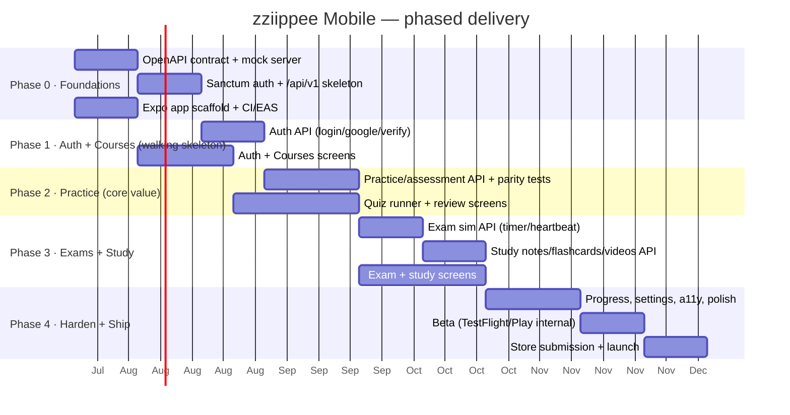

# 6 · Delivery Roadmap

Contract-first, parallel workstreams. Estimates assume a small team (see §6.4) and
are planning-grade, not commitments.

## 6.1 Phases

## 6.2 What each phase delivers

| Phase | Backend | Mobile | Exit criteria |
|---|---|---|---|
| **0 · Foundations** | OpenAPI 3.1 published + mock; Sanctum installed; `api/v1` route group + `EnsureEnrolledApi`; CI | Expo app scaffold, Expo Router, theme tokens, axios client, EAS pipelines | Mock server live; app boots; token stored/read; pipelines green |
| **1 · Auth + Courses** | `/auth/*`, `/enrollments`, `/dashboard`, `/learn/{p}` | Login/Register/Verify/Google; Tabs; My Courses; Course Home | Real user logs in on device, sees real enrollments |
| **2 · Practice** | `/practice/objectives/*`, `/practice/domains/*`, `/assessments/*` + **parity tests vs web** | Practice list, Objective detail, **Quiz runner**, Review, resume | A learner completes an adaptive quiz on device; score/mastery matches web |
| **3 · Exams + Study** | `/exams/*` (timer/heartbeat), study-notes/flashcards/videos | Exam runner (timed, locked), Results/Review, study content screens | Timed exam sim completes end-to-end; study content renders |
| **4 · Harden + Ship** | rate limits, logging, PII review, load check | Progress, Settings (privacy/delete/logout), a11y, empty/offline states, deep links | Beta sign-off; store review passed; production release |

**Fast-follows (post-launch):** PBQ practice (API already JSON — cheap), push
notifications (streaks/reminders), full offline practice packs, tablet layouts,
certificate pinning.

## 6.3 Critical path & dependencies

- **Everything depends on the OpenAPI contract (Phase 0).** Publish it first; the
  mobile team then builds against the mock and never waits on the backend.
- **Phase 2 is the value core** — protect its schedule; it's where product-market
  fit lives. Its main risk is adaptive/exam **parity**, mitigated by shared Services
  + parity tests.
- Auth (Phase 1) unblocks everything device-real; do Google Sign-In early (native
  config + store setup has lead time — Apple/Google developer accounts, bundle ids,
  signing).

## 6.4 Team

| Role | Focus |
|---|---|
| Backend (Laravel) × 1–2 | `/api/v1`, Sanctum, resources, parity tests, OpenAPI |
| Mobile (RN/Expo) × 1–2 | app, runner screens, state/caching, EAS |
| Designer × 1 (part-time) | Figma from doc 5, component library, prototype |
| PM/QA (shared) | contract ownership, device QA (Maestro), store submission |

## 6.5 Definition of done (per feature, mirrors web standards)

- Backend: Pest feature test (incl. **parity** where scoring is involved), `pint`,
  `phpstan` clean; endpoint documented in OpenAPI.
- Mobile: typed against generated DTOs; unit + a Maestro flow; loading/empty/error/
  offline states; light+dark; a11y labels.
- No secrets/PII in logs; token handling reviewed; auth + enrollment ownership checks
  present on every protected route.

## 6.6 Open questions to revisit before Phase 2

1. **Google Sign-In**: confirm native client ids for iOS/Android and that
   `SocialAuthController` can verify an `id_token` (vs the current web redirect flow).
2. **Email verification**: confirm the code-based endpoints can be driven purely by
   JSON for mobile (they appear to be — validate).
3. **Content HTML**: confirm question/notes content is sanitized server-side so the
   app can render it safely (mirror DOMPurify posture).
4. **Enrollment upsell**: agree the exact "return from web checkout → refresh
   entitlements" deep-link contract.
5. **Analytics/consent**: which events, and how consent (privacy module) maps to
   mobile tracking.
