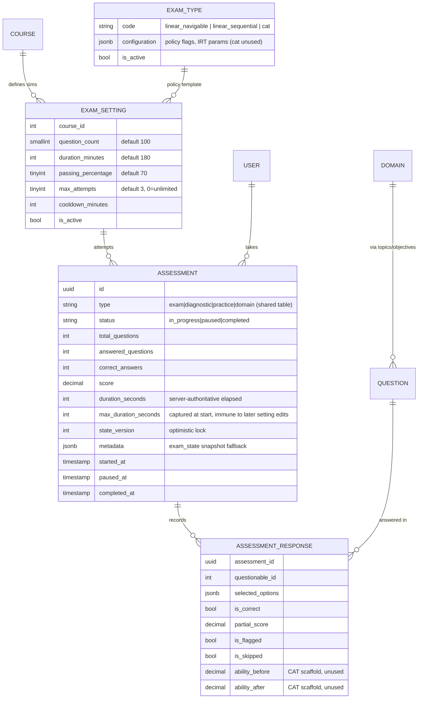
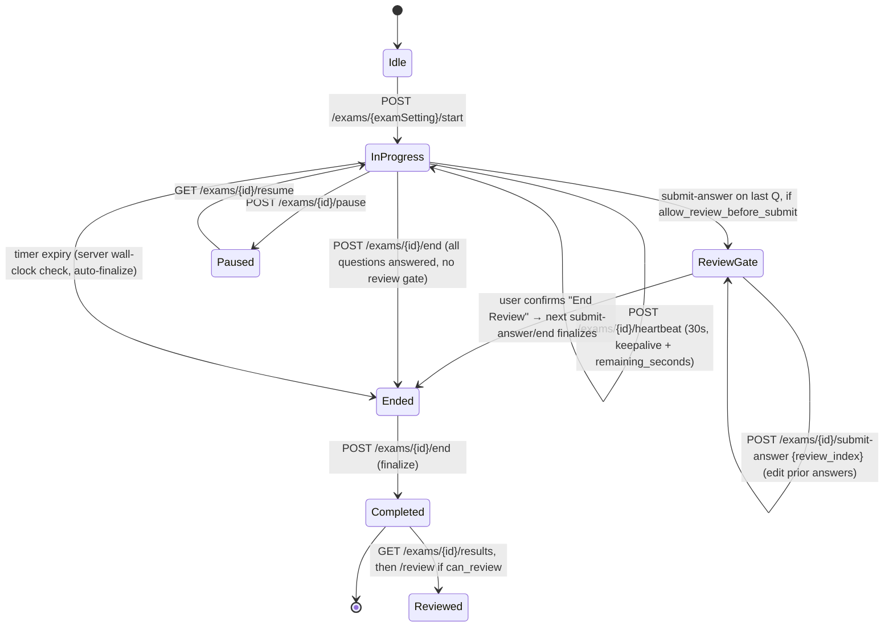

# 8 · Exam Simulation Spec

**Status:** A client-side prototype now exists in `zziippee-mobile` — mock
`/exams/*` routes (`mock/server.mjs`), API hooks (`src/api/hooks/exam.ts`), and
screens (`app/learn/[product]/exams/index.tsx`, `app/exam/[id]/runner.tsx`,
`results.tsx`, `review.tsx`) implementing the design below against the mock
server only. **No real backend work has started** — the session-vs-stateless
gap in §8.1 is still open, and the prototype's `/results` implements only the
domain-breakdown portion of §8.4/§8.7's contract (see §8.10 for the exact
delta). This doc supersedes the Exam fragments scattered across doc 2 §2.5,
doc 3 §3.5, doc 4 §4.6, and doc 5 screens L/M/N, which sketch a *stateless
REST* contract that **does not match the real backend**. Everything here is
verified against the actual implementation in `/Users/saaz/Projects/zziippee`
(file:line cited throughout) rather than inferred from the planning sketch.
Where the old docs are simply wrong, that's called out under §8.9.

## 8.1 The one fact that changes everything

Practice (`/practice/*`, `/assessments/*`) is a clean, already-stateless JSON API —
doc 3 §3.4 describes it accurately, and `PracticeController` in the API stub
(`backend-stubs/routes/api_v1.php:44-53`) is real and buildable today.

**Exams are not.** The real exam module lives entirely under `routes/web.php`
(zziippee `routes/web.php:267-312`), Inertia-rendered, `auth+verified+enrolled`
session middleware. Critically, `ExamSessionManager` (zziippee
`app/Services/ExamSessionManager.php`) stores the **entire live-exam state** —
question order, current index, answers, resolved policy — in the **PHP session**
(key `learn_exam_state_{product_id}`), not purely in a DB row a bearer token can
address. `start`/`resume`/`take` are session-cookie + CSRF Inertia redirects, not
JSON. Only `submit-answer` / `pause` / `end` / `heartbeat` return JSON, and even
those read/write the session as their primary state store (mirroring a trimmed
snapshot to `assessments.metadata->exam_state` as a fallback — see §8.3).

A Sanctum bearer-token React Native client cannot participate in a PHP session.
**This means the `/exams/*` surface in doc 3 §3.8's checklist cannot simply be
"mirror `ExamsController`"** the way Practice was mirrored — that checklist item
undersells the work by an order of magnitude. Two paths forward:

| Option | What it means | Verdict |
|---|---|---|
| **A. Replicate the session dance** | Cookie jar + CSRF token in the RN client, mimic Inertia's redirect flow for start/resume/take | Rejected — fragile, un-idiomatic for a native client, breaks the "stateless JSON" principle every other mobile endpoint follows |
| **B. New stateless `/api/v1/exams/*` endpoints** | Backend team builds a parallel, DB-only exam surface reusing the same engines/services but persisting state to `assessments` + `assessments.metadata` instead of the PHP session | **Recommended** — this doc specs that surface (§8.4) so it reproduces the real engine's guarantees exactly |

**This is new backend work, not just "expose existing controller as JSON."**
Flag this to the backend team before committing to the Phase 3 timeline in doc 6
§6.1 (`Exam sim API (timer/heartbeat) : 2w` is optimistic once this is understood).

## 8.2 Domain model (verified)

Key points that don't match the doc-3 sketch:

- **There is no dedicated `ExamAssessment` model.** `Assessment` is the same
  shared table Practice uses (`type` column distinguishes `exam` from
  `objective`/`domain`), which is good news — the mobile app's existing
  `useAssessment`-style patterns transfer.
- `exam_types` seeds three rows (`database/seeders/ExamTypesSeeder.php`):
  `linear_navigable` (full nav, backtrack, skip, palette), `linear_sequential`
  (LOFT-style — maps to `SimulationEngine`, no backtrack/skip), and `cat`
  (`is_active: false` — data-only IRT scaffold, no engine consumes it). **CAT does
  not exist as a runtime engine** — `ExamEngineFactory` explicitly falls back
  every adaptive setting to `linear_locked` "until a CAT engine exists"
  (`app/Exam/Factories/ExamEngineFactory.php:14-15`). Don't build any mobile UI
  that assumes adaptive exam behavior.

## 8.3 Policy model — what actually gates the UI

`ExamPolicyResolver::resolve(ExamSetting)` (zziippee
`app/Services/ExamPolicyResolver.php`) is the single source of truth for exam UI
behavior. It reads `exam_type.configuration['policy']` and returns:

| Policy key | Drives |
|---|---|
| `navigation_mode` | `'linear_navigable'` → `LinearPracticeEngine`; `'linear_locked'` → `SimulationEngine` decorator (forward-only, no edits) |
| `allow_backtrack` | Show question palette / Previous button at all |
| `allow_skip` | "Skip" affordance; unanswered questions submittable |
| `allow_mark_for_review` | Flag-for-review affordance |
| `allow_review_before_submit` | Server inserts a **review gate** step before finalizing (see §8.5) |
| `allow_review_after_submit` | Gates whether `/review` (answer key) is reachable post-completion at all |
| `adaptive_mode` | Always `false` today (CAT inert per §8.2) |

**Correction to doc 5 §5.4:** "in `linear_locked` sim mode, no back-nav, no answer
changes after Next" is right, but the doc-3/doc-5 sketch never mentions the
**review-before-submit gate**, which is a real, distinct UI state the mobile
runner must implement (§8.5) — it's not just Runner → Results, there's an
optional Runner → Review-lock → Results step in between when
`allow_review_before_submit` is true.

**Guideline copy caveat:** `Index.vue`'s guideline list is built from
`allow_skip`/`allow_backtrack` plus static copy including *"The exam timer
continues even if you close the browser"* — true in intent but only enforced via
wall-clock reconciliation on next contact (§8.6), not a literal running
server-side clock while disconnected. Don't over-promise this in mobile copy;
say "the timer keeps counting against the real deadline" rather than implying
a live push.

## 8.4 Proposed stateless API surface (new backend work)

This replaces doc 3 §3.5 wholesale. Same envelope/auth conventions as the rest
of doc 3 (`Authorization: Bearer`, `ApiResponse` envelope, UUID assessments).
Every endpoint below must be backed by `assessments` + `assessments.metadata`
directly — **no PHP session dependency** — while still delegating to the real
`ExamEngineFactory` → `LinearPracticeEngine`/`SimulationEngine`, `ExamScoringService`,
`ExamPolicyResolver`, `ExamStateGuardService` so behavior stays identical to web.

| Method | Path | Notes |
|---|---|---|
| GET | `/learn/{product}/exams` | List `exam_settings` for the course: `id, exam_type.name, question_count, duration, duration_for_humans, passing_percentage, max_attempts, has_unlimited_attempts, attempt_count, can_take_exam, has_in_progress_attempt, in_progress_assessment_id, cooldown_ends_at, policy` — mirrors `ExamsController::index` props (zziippee line 79-96), **not** the unpopulated `randomizeQuestions/showResults/...` keys `Index.vue` declares but the controller never fills (§8.9). |
| POST | `/exams/{examSetting}/start` | → `{assessment_id, question, questions?, current_question_number:1, total_questions, answered_count:0, deadline_at, duration_limit_seconds, state_version:0, policy}`. `questions` is the full ordered set (sans `correct_options`) and is present **only** when `policy.pre_selected_question_set` is true (linear_navigable) — it's how the client palette-navigates without a separate "jump to index" endpoint; locked/sequential exams omit it and the client only ever sees one question at a time, matching `on_the_fly_by_blueprint` selection. Backend: if an in-progress attempt already exists, return it instead of creating a new one (mirrors the web redirect-to-resume in `ExamsController::start`, line 141). Enforce `max_attempts`/`cooldown_minutes` → `409` or `422` with a clear reason if blocked. |
| GET | `/exams/{assessment}` | Resume-aware current state: `question, questions?, answers? (index→selected_options, navigable only, for rehydrating the palette after a resume), current_question_number, total_questions, answered_count, remaining_seconds (computed from deadline_at, not session), state_version, policy`. Auto-finalize + redirect-equivalent (`{completed:true, redirect_to:"results"}`) if server-side expiry check trips (§8.6). |
| POST | `/exams/{assessment}/submit-answer` | Body: `{question_id, response_id?, review_index?, selected_options[], duration?, state_version, idempotency_key}` — same validation as `ExamsController::submitAnswer` (zziippee line 356-364). Response shape branches exactly as the real controller does: normal advance `{completed:false, question, response:{id}, progress, current_question_number, answered_count, state_version}`; review-gate reached `{completed:false, review_ready:true, ...}`; finalized `{completed:true, redirect_to:"results", state_version}`; stale version → **409** `{message, state_version}`; duplicate idempotency key → **200** `{duplicate:true, state_version}` (no reprocessing). Throttle `90/min`. **Never include `correct_options`/`justifications` in this response** — see §8.6. **Edge case:** once the review gate is reached, the server's forward pointer sits on the last question, so an edit to *that specific* question arrives with `review_index === current_index` — it is indistinguishable from a plain forward resubmit and must be handled by the same branch that re-enters the review-gate response (idempotently), not by the `review_index`-edit branch, which only fires when the two differ (i.e. editing an *earlier* question). Get this wrong and re-editing the last question during review either 404s or double-counts `answered_count`. |
| POST | `/exams/{assessment}/pause` | `{state_version, idempotency_key}` → `{status:"paused", state_version}`. Throttle `10/min`. |
| GET | `/exams/{assessment}/resume` | Rehydrate after pause: same shape as GET `/exams/{assessment}`. |
| POST | `/exams/{assessment}/heartbeat` | `{elapsed}` → `{ok:true, remaining_seconds}`. **Deviation from web on purpose:** the real `heartbeat` (zziippee line 643) doesn't return remaining time — the client just keeps a local countdown. For mobile, since backgrounding/foregrounding is more aggressive than a browser tab, **have the new endpoint return authoritative `remaining_seconds`** so the app can re-sync its countdown on every heartbeat and on foreground, per doc 4 §4.6. Throttle `30/min`, called every 30s. |
| POST | `/exams/{assessment}/end` | `{state_version, idempotency_key}` → `{completed:true, redirect_to:"results", state_version}`. Throttle `10/min`. |
| GET | `/exams/{assessment}/results` | `{assessment:{status,score,correct_answers,total_questions,answered_questions,duration_seconds,started_at,completed_at}, passing_percentage, can_review, summary:{domains,topics,blooms}, advanced_analytics:{time_analysis,confidence_signals}, historical_summary, action_plan}` — mirrors `ExamsController::results` props (zziippee line 686) 1:1. `can_review` = `policy.allow_review_after_submit`. |
| GET | `/exams/{assessment}/review` | Only reachable if `can_review`; else `403`. `{responses:[{id, question_id, selected_options, duration, is_correct, question:{content, options, correct_options, justifications, explanation, topics}}]}` — this is the **only** endpoint anywhere in the exam surface allowed to return `correct_options`/`justifications`, exactly matching web (§8.6). |

Server-side, all of the above should share the exact same
`ExamPolicyResolver`/`ExamScoringService`/`ExamStateGuardService` instances the
web controller uses (constructor-inject, don't reimplement) — this is what doc 2
§2.7's parity principle actually requires here, and it's the only way to keep
mobile/web scoring and policy behavior from drifting.

## 8.5 Lifecycle (corrected)

This corrects doc 2 §2.5's state diagram, which omits the review-gate state
entirely and shows `end`/`resume` on the wrong verbs.

## 8.6 Security & integrity — behaviors the mobile client must replicate

These are hardened, real backend behaviors (per
`docs/plans/exam-module-comprehensive-review.md` in the zziippee repo and
verified in code) that the mobile spec must not regress:

- **No answer-key leakage.** `correct_options`/`justifications` must never appear
  in `start`, `GET /exams/{assessment}`, or `submit-answer` responses — only in
  `/review` post-completion, gated by `can_review`. The client renders
  correctness only from the `is_correct` flag the server includes in the answer
  advance response, never by comparing selections locally.
- **Server-authoritative timer, not a live push.** The real gate is wall-clock:
  `now() - started_at >= max_duration_seconds` is checked on every
  `submit-answer`/`GET state` call and force-finalizes past-deadline attempts
  server-side — a manipulated client clock cannot buy extra time. The client's
  own countdown (seeded from `deadline_at`, corrected on each heartbeat per §8.4)
  is cosmetic UX, matching how `QuizTimer.vue` is purely cosmetic on web. Don't
  build any client-side "grace period" logic — trust the server's `completed:true`
  response on the next call after expiry.
- **`duration_seconds` is monotonic.** Authoritative elapsed = `max(client-reported, wall-clock delta)`, never allowed to shrink. Mirror this if the mobile client ever locally caches elapsed time (e.g. across app kill).
- **Two independent optimistic-lock counters exist server-side** (session-array
  `state_version` vs the `assessments.state_version` DB column used by
  `pause`/`end`) that happen to usually agree but are not the same counter. The
  new stateless endpoints in §8.4 should collapse these into **one** counter on
  the `assessments` row — don't reproduce the dual-track complexity, it's an
  artifact of the session-based implementation this doc is designing around.
- **Idempotency keys must be minted per request-attempt, not reused across
  retries of the same user action.** The web client's convention
  (`${prefix}_${Date.now()}_${random}`) means a genuine duplicate network retry
  with the *same* in-flight payload is deduplicated, but a user **double-tapping**
  generates two different keys and both submissions land. On mobile, where
  `PressableScale`/gesture-handler double-fire is a known risk class (see the
  existing `disabled={revealed || blocked}` guards in `quiz.tsx`), **disable the
  submit control immediately on press** (mutation-pending state, same pattern
  already used in `quiz.tsx`'s `answer.isPending`) rather than relying on
  idempotency keys to absorb double-taps — the backend guard is a safety net for
  network-layer retries, not a UI debounce substitute.
- **409 handling has no auto-retry.** On `state_version` mismatch, update the
  local `state_version` from the error body and surface a toast/banner asking
  the user to retry the action — don't auto-resubmit, matching `Exam.vue`'s
  behavior.
- **Options are shuffled server-side, deterministically per question+user**
  (`OptionShuffler`, seeded by `crc32($questionId)`) — same rule as Practice
  (doc 2 §2.4): the app renders whatever order it receives, never re-sorts.

## 8.7 Mobile runner UX (corrects doc 5 screens L/M/N)

Reuses the visual language and component set from doc 5 §5.2
(`Button`, `Card`, `OptionRow`, `ProgressBar`, `Timer`) and the existing
`quiz.tsx`/`review.tsx` patterns (server-authoritative correctness, reveal-after-
submit, `PressableScale` + `expo-haptics` on selection/submit, `Markdown` +
`questionMarkdownStyle`/`scrollableMarkdownRules` for content, `BlurView` sticky
footer). New/different from the Practice runner:

**Screen L — Exams List** (`learn/[product]/exams/index.tsx`)
- Stat row: question count · duration · passing % · attempts (`∞` when
  `has_unlimited_attempts`).
- CTA label/state: `"Resume Exam"` (amber) if `has_in_progress_attempt`, else
  `"Start Exam"` (indigo); disabled with reason text when `!can_take_exam`
  (cooldown or attempts-exhausted banner, using `cooldown_ends_at`).
- Guidelines list generated **only** from the real policy flags returned
  (`allow_skip`, `allow_backtrack`) plus the two always-true static lines
  ("multiple choice, one correct answer per question" / "timer counts against
  the real deadline even if you background the app") — do not add
  randomize/show-correct-answers copy; the backend never populates those flags
  (§8.9).

**Screen M — Exam Runner** (`exam/[id]/runner.tsx`)
- Countdown seeded from `deadline_at`/`remaining_seconds`; amber < 5 min, red <
  1 min; re-synced on every `heartbeat` response and on `AppState` foreground
  transition (doc 4 §4.6's "can't gain time by backgrounding" rule).
- **Locked-nav (simulation) mode** (`navigation_mode === 'linear_locked'`): hide
  the question palette entirely, no Previous button, no edit-after-Next — this
  already matches doc 5, keep it.
- **Review-gate state** (new, missing from doc 5): when a `submit-answer`
  response comes back `review_ready:true`, transition the runner into a
  **Review-lock screen** — show all questions with answered/unanswered status,
  allow tapping into any question to change its answer
  (`submit-answer {review_index}`) if `allow_backtrack`, with a prominent
  **"End Review"** action that, once confirmed, locks all further edits and
  reveals **"End Exam"**. This is a distinct state from both the runner and
  results — don't collapse it into either.
- Submit control disables immediately on press (see §8.6 double-tap note).
- No client-side inactivity auto-pause modal in v1 (the web's 5-minute
  inactivity dialog is client-only and easy to defer) — the server-side wall-
  clock expiry check is the real backstop; add UX inactivity handling as a
  fast-follow if desired, not a blocker.

**Screen N — Exam Results** (`exam/[id]/results.tsx`)
- Score ring vs `passing_percentage` marker, pass/fail coloring — matches doc 5.
- Domain performance bars (`summary.domains`), Bloom cognitive-profile bars
  (`summary.blooms`, empty-state copy when no Bloom data), strengths/focus-area
  topic lists (`summary.topics`).
- Time Intelligence card: avg correct/incorrect answer time, "answered
  correctly in <20s but flagged" / "took >90s but correct" confidence signals
  (thresholds are server-fixed at 20s/90s — just render what's returned, don't
  hardcode thresholds client-side).
- Action plan checklist (`action_plan`, domain→objective→missed-topics, ascending
  accuracy order) — link each item to Study Notes for that topic (`learn/[product]/study-notes/{topic}`).
  This is a natural place to fix doc 6 §6.6's implied gap: an actionable
  empty/low-score state that routes into study content, not a dead end.
- "Review Questions & Answers" CTA only rendered when `can_review` is true.

**Screen — Exam Review** (`exam/[id]/review.tsx`)
- Sequential viewer, same `OptionContent`/rationale-panel visual pattern as the
  Practice `review.tsx`, but data comes from the completed-only `/review`
  endpoint (§8.4) which is the sole source of `correct_options`/`justifications`
  for exams.

## 8.8 API contract addendum for `src/api/`

Following the existing `src/api/hooks/practice.ts` convention (`useAssessment`,
`useAnswer`, `useReview` — as used in `quiz.tsx`/`review.tsx`), add
`src/api/hooks/exam.ts` with the mirrored shape: `useExamSettings(product)`,
`useExamStart(examSetting)`, `useExam(assessmentId)` (resume-aware GET),
`useExamAnswer(assessmentId)`, `useExamHeartbeat(assessmentId)`,
`useExamPause(assessmentId)`, `useExamEnd(assessmentId)`,
`useExamResults(assessmentId)`, `useExamReview(assessmentId)`. Cache policy
(doc 4 §4.4 table): exam list/settings cacheable short-`staleTime`; everything
under an active attempt (`submit-answer`, `pause`, `heartbeat`, `end`) is a
**mutation only, never cached**, same rule as Practice.

## 8.9 Corrections to existing docs

| Doc | Claim | Reality |
|---|---|---|
| 02 §2.5 | State diagram: `start → InProgress → ... → Completed → Review` | Missing the review-gate state (§8.5); `resume` is a `GET`, not shown |
| 03 §3.5 | "Mirrors `ExamsController` + `ExamEngineFactory`" as if it's a drop-in JSON mirror | It's session-based Inertia; needs new stateless endpoints (§8.1, §8.4) |
| 03 §3.5 | `GET /exams/{assessment}/results` returns "score, pass/fail, per-domain breakdown" | Real payload also includes Bloom analytics, time-intelligence/confidence signals, action plan, historical summary (§8.4) — worth exposing on mobile, not just a score card |
| 04 §4.6 | Heartbeat only described as keepalive | Real web heartbeat doesn't return remaining time; mobile's version should (§8.4) — a deliberate deviation, not a bug |
| 05 §5.4 (screen M) | "Question palette optional" | Palette visibility is fully policy-driven (`allow_backtrack`), not a design option — hide it outright in locked/simulation mode |
| 06 §6.1/§6.2 | "Exam sim API (timer/heartbeat) : 2w" | Needs re-estimation once the session-vs-stateless gap (§8.1) is scoped with backend |
| backend-stubs `routes/api_v1.php:67-70` | Exam routes commented out, "mirror ExamsController" | Correct that they're unbuilt; the mirror instruction needs to point at §8.4 of this doc, not the web controller directly |

## 8.10 Prototype status (mock-only — no real backend exists)

A full client-side implementation of §8.4–§8.7 runs against a mock, not the
real backend described in §8.1:

- `mock/server.mjs` — in-memory session state machine for `/exams/*`, covering
  start/resume/GET-state/submit-answer (forward + review-index edit)/pause/
  heartbeat/end/results/review, with `state_version` optimistic locking and
  idempotency-key deduplication matching §8.6.
- `src/api/hooks/exam.ts` — the TanStack Query hook surface from §8.8.
- `app/learn/[product]/exams/index.tsx`, `app/exam/[id]/runner.tsx`,
  `results.tsx`, `review.tsx` — Screens L/M/N + Review from §8.7, including the
  review-before-submit gate and locked vs. navigable policy branching.

**Known gap — this does *not* mean the real backend can be built by mirroring
the prototype's `/results` shape.** The mock's results response implements
only `summary.domains.performance` (per-domain accuracy bars). It does **not**
implement `summary.topics`, `summary.blooms`, `advanced_analytics.time_analysis`
/`confidence_signals`, `historical_summary`, or `action_plan` — all of which
§8.4 and §8.7 (Screen N) document as part of the real contract, sourced from
`ExamsController::buildPerformanceSummaries()`/`buildActionPlan()`/
`buildAdvancedAnalytics()` on the web side. These were deliberately scoped out
of the prototype (no Bloom/topic/timing data exists in the mock's question
fixtures to make them meaningful) — the real backend work in §8.4 should still
implement the full contract, not the narrowed prototype subset.

Everything else in §8.1–§8.9 (the session-vs-stateless architectural gap, the
proposed endpoint contract, the security/integrity behaviors) remains a design
spec for backend work that has not started — the prototype only proves out the
mobile-side contract and UX against a stand-in.
